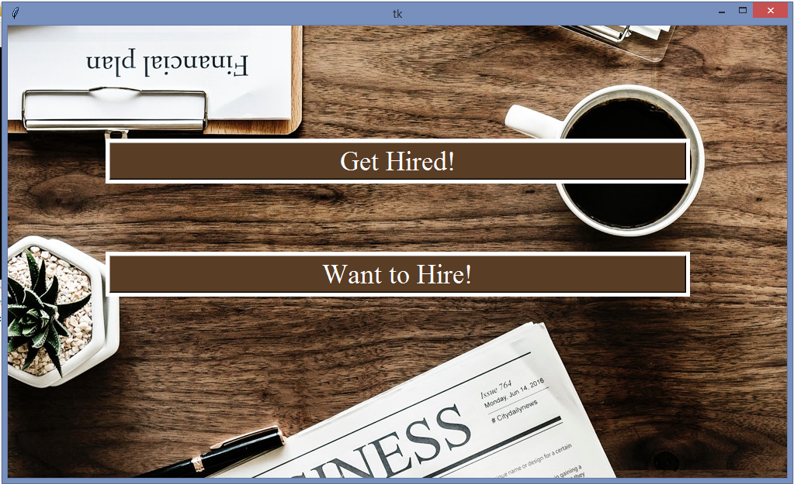
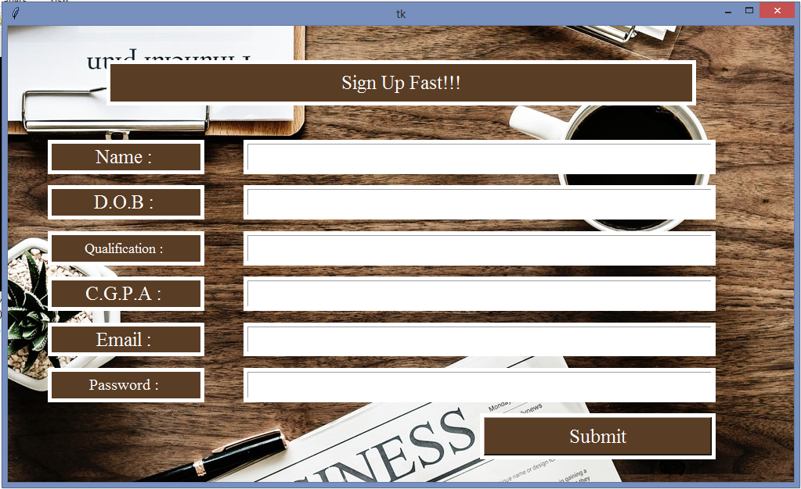
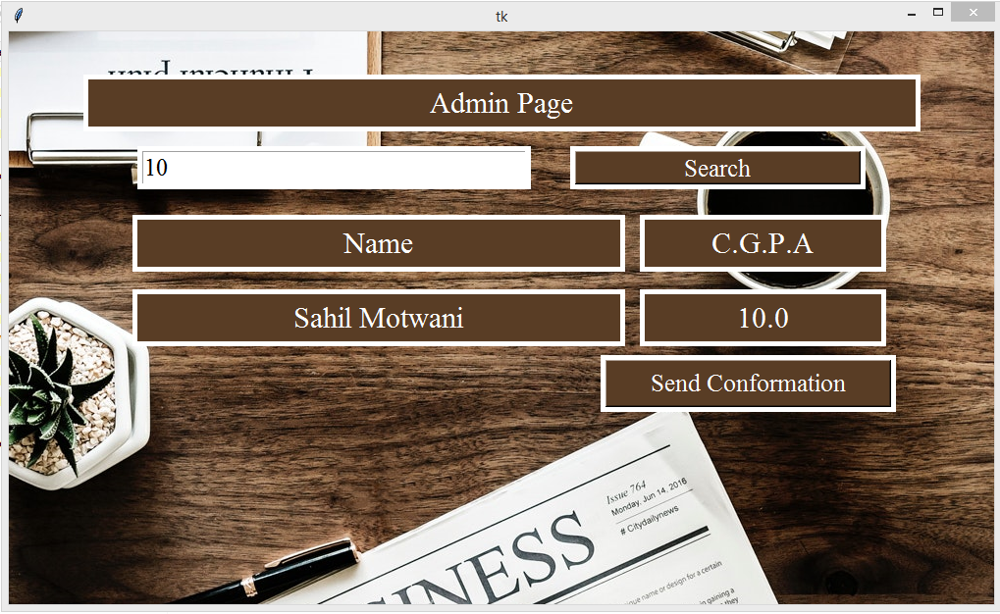

# Placement-Helper
It is Python based GUI App used for students to apply for company and its
main use is for recruiter which can filter out students according to
requirements like skills, required salary, CGPA, etc. 
After shortlisting students automatic mail will be sent to all of them 
simultaneously.
# Landing Page

# Get Hired

# Want To Hire

